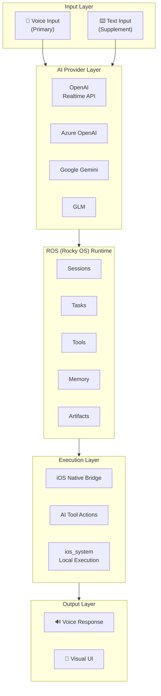
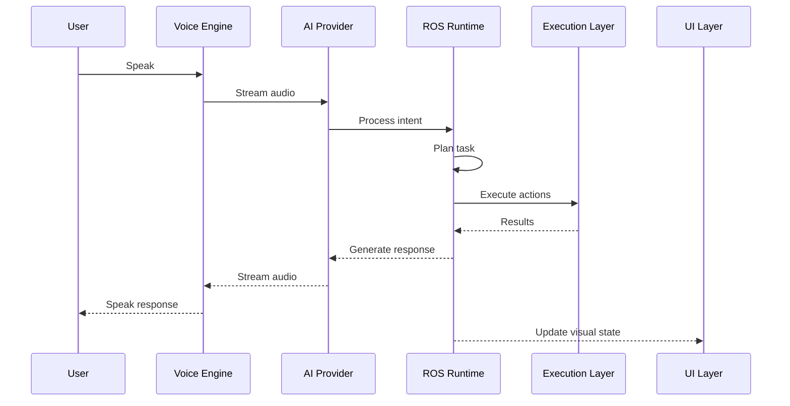
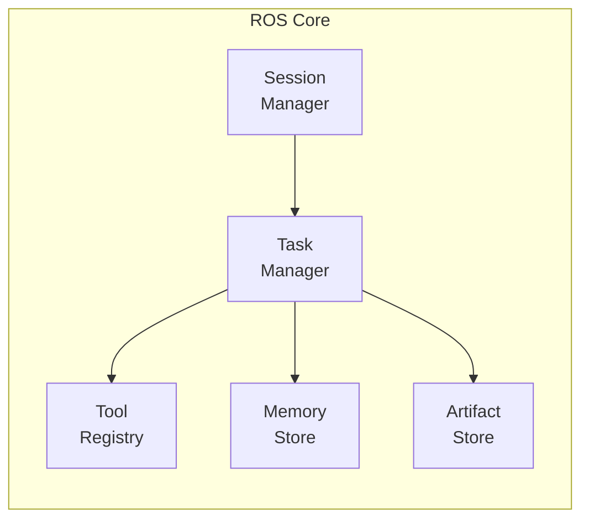
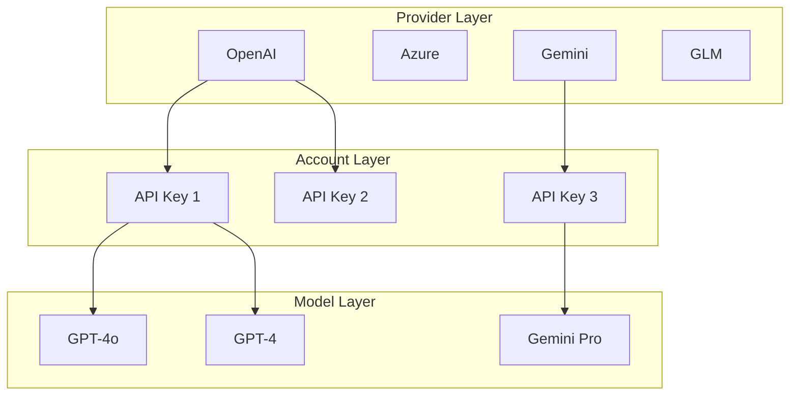

# Architecture

## Overview

Rocky uses a hybrid architecture that combines voice interaction, AI model services, and on-device execution into a cohesive agent experience on iOS and iPadOS.

### System Architecture

### Data Flow

## ROS — Rocky OS

ROS is the internal runtime core that organizes:

- **Sessions** — Conversation and task contexts
- **Tasks** — Planned and executing operations
- **Tools** — Available capabilities and actions
- **Memory** — Persistent context across sessions
- **Artifacts** — Files, results, and outputs

### ROS Component Architecture

## Execution Layers

Rocky has three execution layers:

### iOS Native Bridge

Direct access to iOS and iPadOS system capabilities — contacts, calendar, notifications, files, and more. These run as native Swift code.

### AI Tool Layer

Actions requested by the AI model — web search, code generation, analysis, etc. These are dispatched through the provider API.

### Local Execution (ios_system)

A controlled local execution environment using [ios_system](https://github.com/holzschu/ios_system). Supports shell commands, Python scripts, and WASM modules in a sandboxed environment.

## Provider Architecture

Rocky uses a three-layer abstraction for model providers:

1. **Provider** — The service (OpenAI, Azure, Gemini, etc.)
2. **Account** — Your credential / API key for a provider
3. **Model** — The specific model to use (GPT-4, Gemini Pro, etc.)

This allows connecting multiple accounts and switching between providers seamlessly.

## UI Architecture

- **SwiftUI** — The primary UI framework for iOS and iPadOS
- **LanguageModelChatUI** — Chat detail view component by [Lakr233](https://github.com/Lakr233/LanguageModelChatUI)
- **Voice Home** — The first screen; voice-first, not chat-list-first
- **Chat Detail** — Task execution detail page, not the primary interface

## Key Dependencies

| Library | Purpose |
|---------|---------|
| [SwiftOpenAI](https://github.com/jamesrochabrun/SwiftOpenAI) | OpenAI API & Realtime sessions |
| [LanguageModelChatUI](https://github.com/Lakr233/LanguageModelChatUI) | Chat detail view component |
| [MarkdownView](https://github.com/Lakr233/MarkdownView) | Markdown rendering |
| [ios_system](https://github.com/holzschu/ios_system) | Local execution layer |
| [Python-Apple-support](https://github.com/beeware/Python-Apple-support) | Python runtime on iOS |
