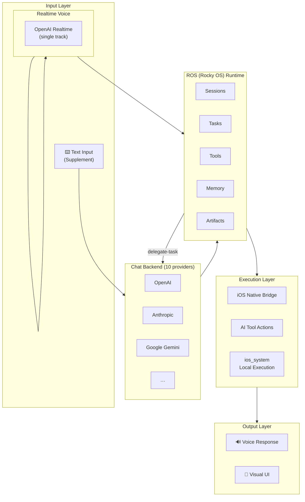
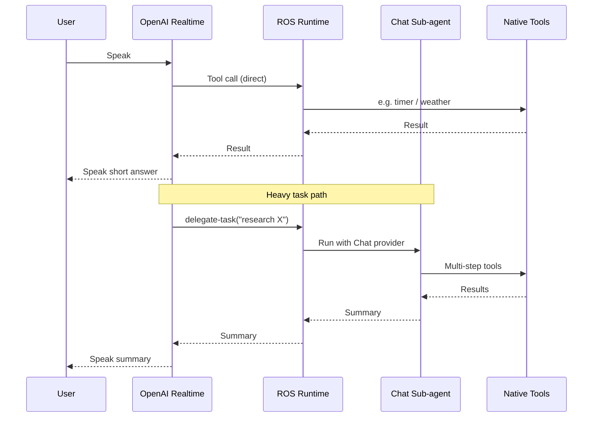
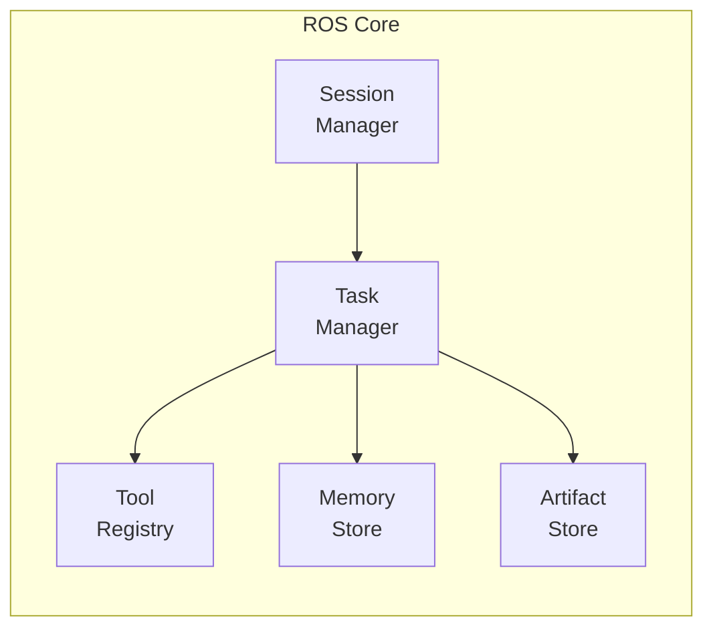
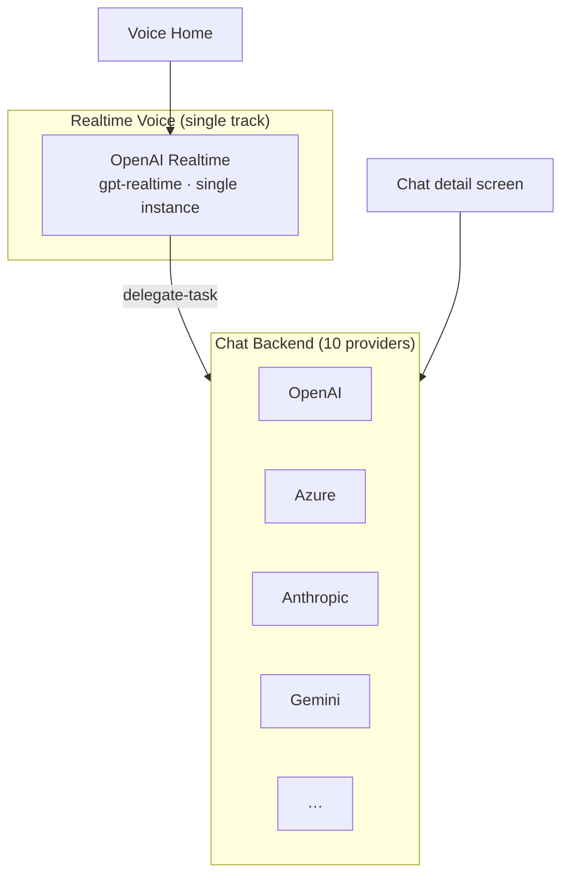

# Architecture

## Overview

Rocky uses a hybrid architecture that combines voice interaction, AI model services, and on-device execution into a cohesive agent experience on iOS and iPadOS.

### System Architecture

### Data Flow

The voice model handles low-latency turns directly. For multi-step or research-heavy work it calls the `delegate-task` tool, which spins up a back-end **Chat sub-agent** that runs to completion and returns a single summary the voice model speaks back.

## ROS — Rocky OS

ROS is the internal runtime core that organizes:

- **Sessions** — Conversation and task contexts
- **Tasks** — Planned and executing operations
- **Tools** — Available capabilities and actions
- **Memory** — Persistent context across sessions
- **Artifacts** — Files, results, and outputs

### ROS Component Architecture

## Execution Layers

Rocky has three execution layers:

### iOS Native Bridge

Direct access to iOS and iPadOS system capabilities — contacts, calendar, notifications, files, and more. These run as native Swift code.

### AI Tool Layer

Actions requested by the AI model — web search, code generation, analysis, etc. These are dispatched through the provider API.

### Local Execution (ios_system)

A controlled local execution environment using [ios_system](https://github.com/holzschu/ios_system). Supports shell commands, Python scripts, and WASM modules in a sandboxed environment.

## Provider Architecture — Two Tiers

Rocky uses a two-tier provider model. Both tiers live under **Settings → Model** in the app.

**Realtime Voice** drives the home-screen voice loop. There's exactly one realtime backend (OpenAI Realtime) and one active configuration — it's not a list.

**Chat backend** uses the classic three-layer abstraction:

1. **Provider** — OpenAI, Azure, Anthropic, Gemini, Groq, xAI, OpenRouter, DeepSeek, Doubao, AIProxy
2. **Account** — your credential / API key (multiple accounts allowed per provider)
3. **Model** — the specific model to use

The Chat backend serves two purposes: the chat detail screen (text-mode interaction) and the back-end agent that the voice model delegates complex tasks to.

## UI Architecture

- **SwiftUI** — primary UI framework for iOS and iPadOS
- **LanguageModelChatUI** — chat detail view component by [Lakr233](https://github.com/Lakr233/LanguageModelChatUI)
- **Voice Home** — the first screen, voice-first not chat-list-first. Single-orb canvas with TimelineView-driven pulse rings, a live waveform during listening, an iMessage-style transcript feed, and a top-bar provider chip showing the live realtime model + connection state.
- **Chat Detail** — task execution detail page, reachable from the home top-bar. Not the primary interface.
- **Settings** — Realtime Voice and Chat live under a single **Model** group (one place to look, two halves to set up).

## Key Dependencies

| Library | Purpose |
|---------|---------|
| [SwiftOpenAI](https://github.com/jamesrochabrun/SwiftOpenAI) | OpenAI API & Realtime sessions |
| [LanguageModelChatUI](https://github.com/Lakr233/LanguageModelChatUI) | Chat detail view component |
| [MarkdownView](https://github.com/Lakr233/MarkdownView) | Markdown rendering |
| [ios_system](https://github.com/holzschu/ios_system) | Local execution layer |
| [Python-Apple-support](https://github.com/beeware/Python-Apple-support) | Python runtime on iOS |
