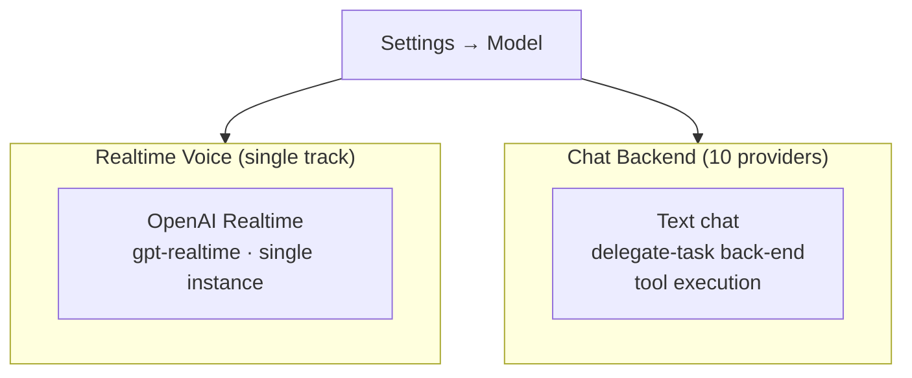
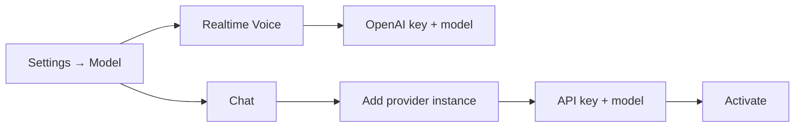

# Provider Configuration

Rocky has a **two-tier provider model**: a single-track Realtime Voice (the live voice loop on the home screen) and a multi-provider Chat backend (text chat *and* the back-end agent the voice model delegates complex work to). Both tiers live under one settings group.

## Two Tiers

- **Realtime Voice** — drives the home-screen voice loop. One backend, one active configuration.
- **Chat backend** — drives the chat detail screen *and* the sub-agent that the voice model calls via `delegate-task`. Multiple instances, one active at a time.

## Realtime Voice

Single-track. There is exactly one realtime backend and one active configuration.

### OpenAI Realtime

- **Models:** `gpt-realtime`, `gpt-realtime-mini`
- **API Key:** same key you'd use for OpenAI Chat (`https://platform.openai.com/api-keys`)
- **Features:** low-latency voice, restricted tool surface (heavier work goes through `delegate-task`)
- **Config:** **Settings → Model → Realtime Voice**

Earlier builds shipped a GLM Realtime backend; it has been removed. The `OpenRockyRealtimeVoiceClient` protocol stays so an additional backend can be added later.

## Chat Backend

Three-layer abstraction (Provider → Account → Model). Multi-instance — configure as many accounts as you like and switch the active one freely.

### OpenAI

- **Models**: GPT-5, GPT-4o
- **API Key**: From [platform.openai.com](https://platform.openai.com)

### Anthropic

- **Models**: Claude Sonnet 4
- **API Key**: From [console.anthropic.com](https://console.anthropic.com)

### Azure OpenAI

- **Models**: GPT-4o (Azure deployment)
- **Setup**: Requires Azure resource name, deployment name, API version, and API key

### Google Gemini

- **Models**: Gemini 2.5 Pro, Gemini 2.5 Flash
- **API Key**: From Google AI Studio

### Groq

- **Models**: Llama 3.3 70B
- **API Key**: From Groq console

### xAI

- **Models**: Grok 3 Beta
- **API Key**: From xAI platform

### OpenRouter

- **Models**: Multi-model proxy (access many models with one key)
- **API Key**: From OpenRouter

### DeepSeek

- **Models**: DeepSeek Chat
- **API Key**: From DeepSeek platform

### Doubao (Volcengine)

- **Models**: Doubao Seed series
- **API Key**: From Volcengine platform

### AIProxy

- **Models**: Proxy-based access to various models
- **Setup**: Requires service URL configuration

## Configuration

1. Open Rocky and go to **Settings → Model**
2. Set up **Realtime Voice** with your OpenAI key and a `gpt-realtime` model
3. Add at least one **Chat** provider instance and activate it
4. Return to the home screen — the top-bar chip shows the active realtime model with a green status dot when ready

:::tip
You can mix tiers. For example, OpenAI Realtime as the voice track + Anthropic Claude as the Chat back-end is a common pairing for tool-heavy delegation.
:::
