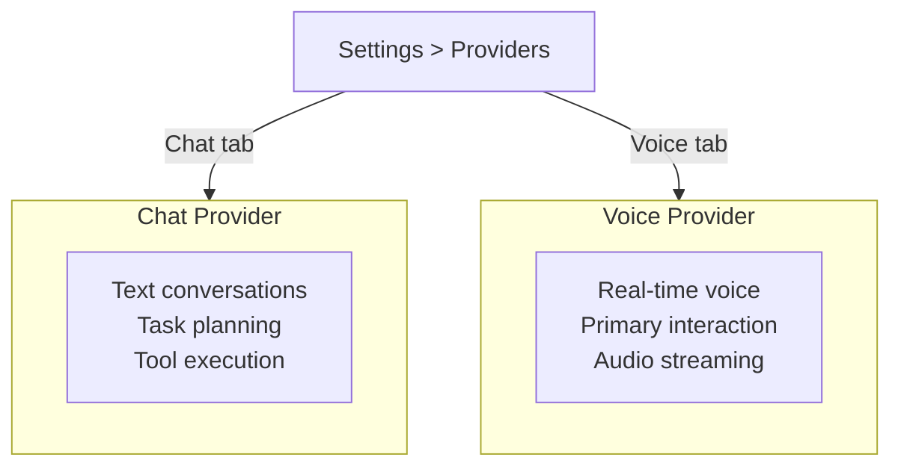
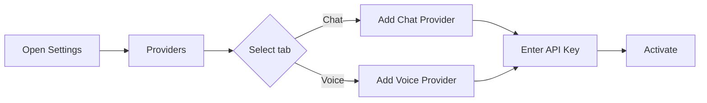

# Provider Configuration

Rocky has **two independent provider systems**: one for Chat (text) and one for Voice (realtime audio). Each can be configured separately with different providers, accounts, and models.

## Two Provider Systems



- **Chat Provider** — Handles text-based conversations, task planning, and tool execution
- **Voice Provider** — Handles real-time voice conversations, the primary interaction mode

Only **one Chat provider** and **one Voice provider** can be active at a time, but you can configure multiple instances and switch between them.

## Provider / Account / Model

Each provider system follows a three-layer architecture:

```
Provider (OpenAI, Anthropic, Gemini, ...)
  └── Account (your API key)
       └── Model (GPT-4o, Claude Sonnet 4, ...)
```

You can configure multiple accounts per provider and switch between models freely.

## Chat Providers

Chat providers handle all text-based interactions.

### OpenAI

- **Models**: GPT-5, GPT-4o
- **API Key**: From [platform.openai.com](https://platform.openai.com)

### Anthropic

- **Models**: Claude Sonnet 4
- **API Key**: From [console.anthropic.com](https://console.anthropic.com)

### Azure OpenAI

- **Models**: GPT-4o (Azure deployment)
- **Setup**: Requires Azure resource name, deployment name, API version, and API key

### Google Gemini

- **Models**: Gemini 2.5 Pro, Gemini 2.5 Flash
- **API Key**: From Google AI Studio

### Groq

- **Models**: Llama 3.3 70B
- **API Key**: From Groq console

### xAI

- **Models**: Grok 3 Beta
- **API Key**: From xAI platform

### OpenRouter

- **Models**: Multi-model proxy (access many models with one key)
- **API Key**: From OpenRouter

### DeepSeek

- **Models**: DeepSeek Chat
- **API Key**: From DeepSeek platform

### Doubao (Volcengine)

- **Models**: Doubao Seed series
- **API Key**: From Volcengine platform

### AIProxy

- **Models**: Proxy-based access to various models
- **Setup**: Requires service URL configuration

## Voice Providers

Voice providers handle real-time audio streaming for voice conversations.

### OpenAI Realtime

The most full-featured voice provider.

- **Models**: GPT Realtime Mini, GPT Realtime
- **API Key**: Same as OpenAI Chat API key
- **Features**: Low-latency, natural voice, multi-turn conversation

### GLM Realtime

Optimized for Chinese language voice interactions via Zhipu AI.

- **Models**: GLM realtime voice models
- **API Key**: From Zhipu AI platform
- **Features**: Tool support via category tools, client VAD, Chinese language optimized

## Configuration



1. Open Rocky app
2. Go to **Settings > Providers**
3. Switch between the **Chat** and **Voice** tabs
4. Tap **Add Provider** and select your provider type
5. Enter your API key and configure the endpoint if needed
6. Tap to activate the provider you want to use

:::tip
You can mix and match — for example, use Anthropic Claude for Chat and OpenAI Realtime for Voice. Each system is completely independent.
:::
