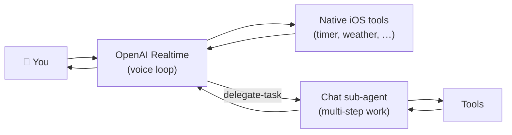

# Voice Interaction

Voice is Rocky's primary — and now *only* — way to start a turn from the home screen. Text remains available inside the chat detail screen.

## How It Works

Rocky uses the **OpenAI Realtime API** as the single voice track. When you tap the orb on the home screen:

1. Audio is captured from the device microphone
2. Streamed in real-time to OpenAI Realtime over WebSocket
3. The model processes speech directly (no intermediate transcription)
4. Response audio is streamed back and played; transcript bubbles render concurrently

This creates a natural, low-latency conversation experience.

## Two-Tier Model

The realtime voice model carries low-latency turns directly. Anything multi-step or research-heavy is handed off to a back-end **Chat sub-agent** through the `delegate-task` tool. The sub-agent uses your configured Chat provider (OpenAI, Anthropic, Gemini, …), runs to completion, then returns a single summary the voice model speaks back.

That separation keeps the voice loop snappy without giving up agent depth.

## Voice vs Text

| | Voice | Text |
|---|---|---|
| **Role** | Primary input | Supplement |
| **Use case** | Tasks, questions, commands | Precise editing, code, URLs |
| **Where** | Home screen orb | Chat detail screen |

## Provider Support

| | OpenAI Realtime |
|---|---|
| Models | `gpt-realtime`, `gpt-realtime-mini` |
| Protocol | WebSocket |
| Tool calls | Yes — restricted set, plus `delegate-task` for the rest |

Earlier builds shipped a second realtime backend (GLM) and a Classic STT + Chat + TTS path. Both have been removed; the `OpenRockyRealtimeVoiceClient` protocol stays so an additional backend can be slotted in later without touching the home view or session runtime.

## The Home Screen

- **One hero orb** — voice identity *and* the action button. Tap to start, tap to stop.
- **Animated pulse rings** — three TimelineView-driven concentric rings, calmer at idle, stronger when the mic is hot.
- **Top-bar provider chip** — shows the active realtime model and a connection dot. Tap to jump to settings.
- **Status pill** — `Tap to talk` / `Connecting…` / `Listening` / `Thinking` / `Responding` / `Ready`.
- **Live waveform** — under the orb while listening.
- **Rotating tip** — at idle ("Try 'Set a 25-minute focus timer'"), cycles every few seconds.
- **Chat-bubble transcript** — recent turns float above the orb iMessage-style. Older bubbles fade; the live turn is full bright with auto-scroll.

## Tips

- Speak naturally — Rocky understands conversational language
- Be specific about tasks — "Send a message to John" beats "Do the thing"
- Voice works best in relatively quiet environments
