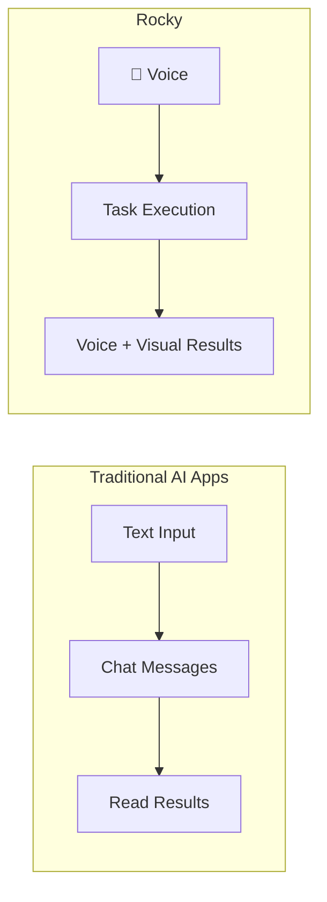

# Introduction

**Rocky** is a voice-first AI Agent app for iPhone and iPad. **OpenRocky** is the open-source project behind it.

Rocky is not a mobile chat shell, nor a ported Linux container on a phone. It puts **voice conversation as the primary entry point**, organizing voice interaction, task execution, system bridging, and result review into an agent experience designed for iOS and iPadOS.

## Why Voice-First?

Most AI apps on mobile are text-based chat interfaces. Rocky takes a fundamentally different approach:

- **Voice is the main entry** — Talk to Rocky like talking to a person. No typing needed.
- **Text is a supplement** — Available when you need precise input like code or URLs.
- **Tasks, not just chat** — Rocky doesn't just respond; it executes tasks and produces real results.

## Core Principles

- **Voice as primary input** — The home screen is a voice interface, not a chat list.
- **Task execution** — Powered by ROS, the internal runtime that plans and runs tasks.
- **iPhone & iPad native** — Built with SwiftUI, using iOS native bridges and on-device execution.
- **Open source** — Transparent development, community-driven.

## Platform Support

| Platform | Status |
|----------|--------|
| iOS (iPhone) | Supported |
| iPadOS (iPad) | Supported |
| macOS | Not planned |
| Android | In development, coming soon |

## Current Status

OpenRocky is in the **documentation-first + early prototype** phase. The repository contains:

- Product positioning, iOS architecture docs, and reference materials
- An early SwiftUI iOS prototype for direction validation

The prototype has verified three key integrations:

- **SwiftOpenAI** — Model access and OpenAI Realtime session bridging
- **LanguageModelChatUI** — Chat detail view mounted in the iOS prototype
- **ios_system** — Controlled local execution layer for runtime environment

## Standard Naming

> Rocky is the app. OpenRocky is the open-source project behind it.

## Links

- [GitHub](https://github.com/openrocky/OpenRocky)
- [Discord](https://discord.gg/SvvsaDA4nE)
- [Telegram](https://t.me/openrocky)
- [Author on X](https://x.com/everettjf)
