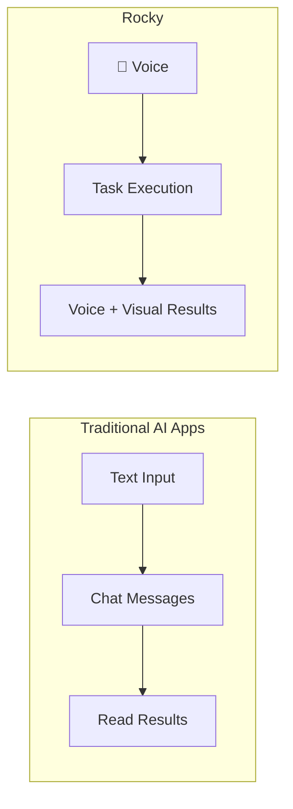

# Introduction

**Rocky** is a voice-first AI Agent app for iOS and Android. **OpenRocky** is the open-source project behind it.

Rocky is not a mobile chat shell, nor a ported Linux container on a phone. It puts **voice conversation as the primary entry point**, organizing voice interaction, task execution, system bridging, and result review into an agent experience designed for iOS, iPadOS and Android.

## Why Voice-First?

Most AI apps on mobile are text-based chat interfaces. Rocky takes a fundamentally different approach:

- **Voice is the main entry** — Talk to Rocky like talking to a person. No typing needed.
- **Text is a supplement** — Available when you need precise input like code or URLs.
- **Tasks, not just chat** — Rocky doesn't just respond; it executes tasks and produces real results.

## Core Principles

- **Voice as primary input** — The home screen is a voice interface, not a chat list.
- **Task execution** — Powered by ROS, the internal runtime that plans and runs tasks.
- **iPhone & iPad native** — Built with SwiftUI, using iOS native bridges and on-device execution.
- **Open source** — Transparent development, community-driven.

## Platform Support

| Platform | Status | Test Link |
|----------|--------|-----------|
| iOS (iPhone) | Testing | [TestFlight](https://testflight.apple.com/join/GZtbEpXN) |
| iPadOS (iPad) | Testing | [TestFlight](https://testflight.apple.com/join/GZtbEpXN) |
| Android | Testing | [Google Play Internal Testing](https://play.google.com/apps/testing/com.xnu.rocky) |
| macOS | Not planned | — |

## Standard Naming

> Rocky is the app. OpenRocky is the open-source project behind it.

## Links

- **Website:** [openrocky.org](https://openrocky.org/)
- **iOS Open Source:** [github.com/openrocky/openrocky](https://github.com/openrocky/openrocky)
- **Android Open Source:** [github.com/openrocky/openrocky_android](https://github.com/openrocky/openrocky_android)
- **iOS Feedback:** [Submit Issue](https://github.com/openrocky/openrocky/issues/new)
- **Android Feedback:** [Submit Issue](https://github.com/openrocky/openrocky_android/issues/new)
- **Telegram:** [@openrocky](https://t.me/openrocky)
- **Discord:** [Join](https://discord.gg/SvvsaDA4nE)
- **Author on X:** [@everettjf](https://x.com/everettjf)
