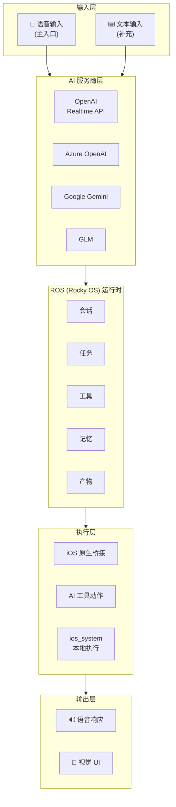
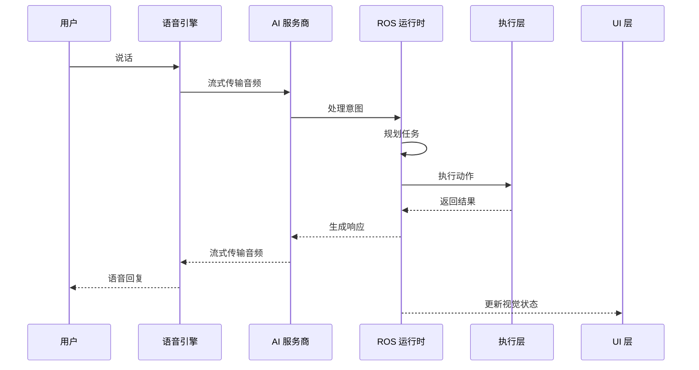
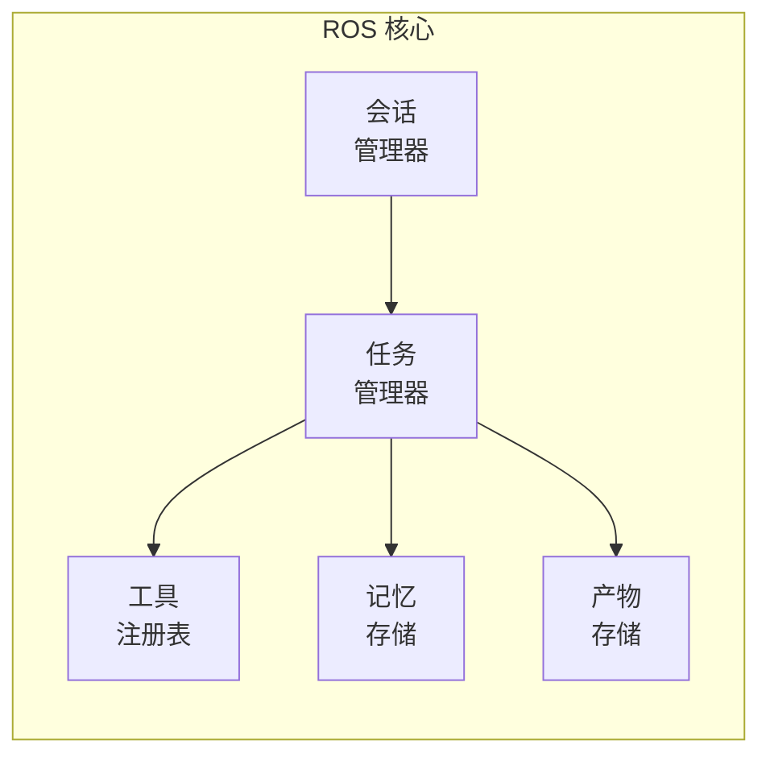
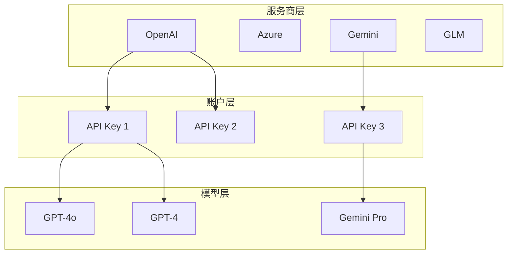

# 架构

## 概览

Rocky 采用混合架构，将语音交互、AI 模型服务和本地执行整合为一个完整的 agent 体验，运行在 iOS 和 iPadOS 上。

### 系统架构

### 数据流

## ROS — Rocky OS

ROS 是内部运行时核心，负责组织：

- **会话** — 对话和任务上下文
- **任务** — 已规划和正在执行的操作
- **工具** — 可用的能力和动作
- **记忆** — 跨会话的持久化上下文
- **产物** — 文件、结果和输出

### ROS 组件架构

## 执行层

Rocky 有三个执行层：

### iOS 原生桥接

直接访问 iOS 和 iPadOS 系统能力 —— 通讯录、日历、通知、文件等。以原生 Swift 代码运行。

### AI 工具层

AI 模型请求的动作 —— 网页搜索、代码生成、分析等。通过服务商 API 分发。

### 本地执行 (ios_system)

使用 [ios_system](https://github.com/holzschu/ios_system) 的受控本地执行环境。支持 shell 命令、Python 脚本和 WASM 模块在沙盒环境中运行。

## 服务商架构

Rocky 对模型服务商使用三层抽象：

1. **服务商** — 服务（OpenAI、Azure、Gemini 等）
2. **账户** — 你的凭证 / API Key
3. **模型** — 具体使用的模型（GPT-4、Gemini Pro 等）

这允许配置多个账户并在服务商之间自由切换。

## UI 架构

- **SwiftUI** — 主要 UI 框架，支持 iOS 和 iPadOS
- **LanguageModelChatUI** — 聊天详情视图组件，来自 [Lakr233](https://github.com/Lakr233/LanguageModelChatUI)
- **语音主页** — 第一界面，语音优先而非聊天列表优先
- **聊天详情** — 任务执行详情页，不是主界面

## 关键依赖

| 库 | 用途 |
|---------|---------|
| [SwiftOpenAI](https://github.com/jamesrochabrun/SwiftOpenAI) | OpenAI API 和 Realtime 会话 |
| [LanguageModelChatUI](https://github.com/Lakr233/LanguageModelChatUI) | 聊天详情视图组件 |
| [MarkdownView](https://github.com/Lakr233/MarkdownView) | Markdown 渲染 |
| [ios_system](https://github.com/holzschu/ios_system) | 本地执行层 |
| [Python-Apple-support](https://github.com/beeware/Python-Apple-support) | iOS Python 运行时 |
