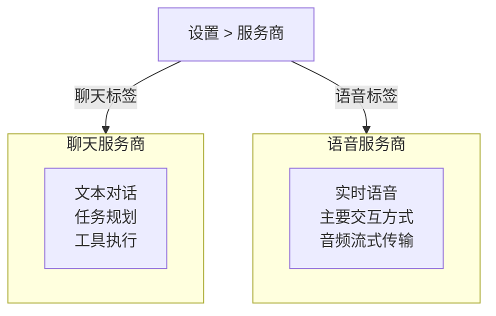
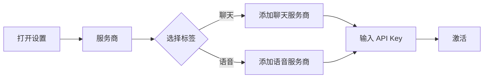

# 服务商配置

Rocky 有**两个独立的服务商系统**：一个用于聊天（文本），一个用于语音（实时音频）。每个系统可以独立配置不同的服务商、账户和模型。

## 两个服务商系统



- **聊天服务商** — 处理文本对话、任务规划和工具执行
- **语音服务商** — 处理实时语音对话，是 Rocky 的主要交互方式

同时只能激活**一个聊天服务商**和**一个语音服务商**，但你可以配置多个实例并自由切换。

## 服务商 / 账户 / 模型

每个服务商系统都遵循三层架构：

```
服务商（OpenAI、Anthropic、Gemini 等）
  └── 账户（你的 API Key）
       └── 模型（GPT-4o、Claude 3.7 等）
```

你可以为每个服务商配置多个账户，并在模型之间自由切换。

## 聊天服务商

聊天服务商处理所有文本交互。

### OpenAI

- **模型**: GPT-5, GPT-4o
- **API Key**: 来自 [platform.openai.com](https://platform.openai.com)

### Anthropic

- **模型**: Claude 3.7 Sonnet
- **API Key**: 来自 [console.anthropic.com](https://console.anthropic.com)

### Azure OpenAI

- **模型**: GPT-4o（Azure 部署）
- **配置**: 需要 Azure 资源名称、部署名称、API 版本和 API Key

### Google Gemini

- **模型**: Gemini 2.5 Pro, Gemini 2.5 Flash
- **API Key**: 来自 Google AI Studio

### Groq

- **模型**: Llama 3.3 70B
- **API Key**: 来自 Groq 控制台

### xAI

- **模型**: Grok 3 Beta
- **API Key**: 来自 xAI 平台

### OpenRouter

- **模型**: 多模型代理（一个 Key 访问多种模型）
- **API Key**: 来自 OpenRouter

### DeepSeek

- **模型**: DeepSeek Chat
- **API Key**: 来自 DeepSeek 平台

### 豆包（火山引擎）

- **模型**: Doubao Seed 系列
- **API Key**: 来自火山引擎平台

### AIProxy

- **模型**: 代理访问各种模型
- **配置**: 需要配置服务 URL

## 语音服务商

语音服务商处理实时音频流式传输，用于语音对话。

### OpenAI Realtime

功能最全的语音服务商。

- **模型**: GPT Realtime Mini, GPT Realtime
- **API Key**: 与 OpenAI 聊天 API Key 相同
- **特点**: 低延迟、自然语音、多轮对话

### GLM Realtime

智谱 AI 的实时语音模型，针对中文优化。

- **模型**: GLM 实时语音模型
- **API Key**: 来自智谱 AI 平台
- **特点**: 分类工具支持、客户端 VAD、中文优化

## 配置方法



1. 打开 Rocky App
2. 进入 **设置 > 服务商**
3. 在 **聊天** 和 **语音** 标签页之间切换
4. 点击 **添加服务商**，选择服务商类型
5. 输入 API Key 并按需配置端点
6. 点击激活你想使用的服务商

:::tip
你可以混搭使用 —— 例如用 Anthropic Claude 做聊天，用 OpenAI Realtime 做语音。两个系统完全独立。
:::
