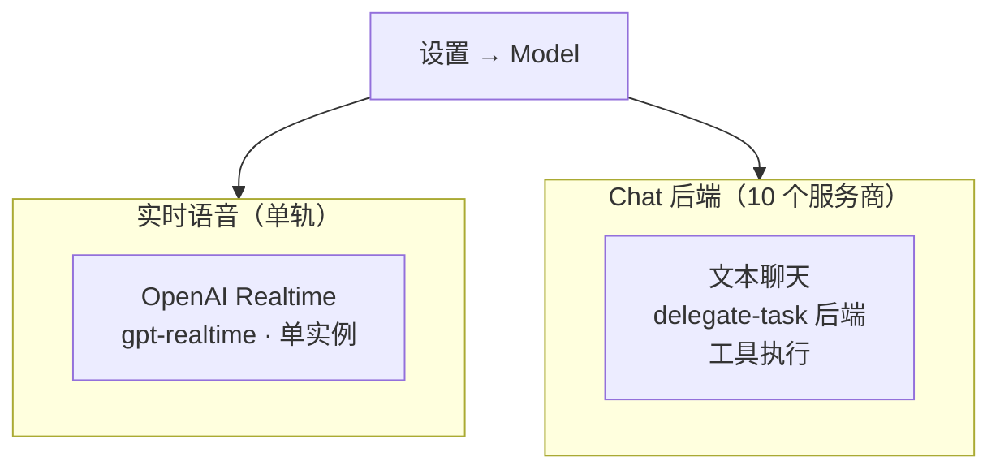
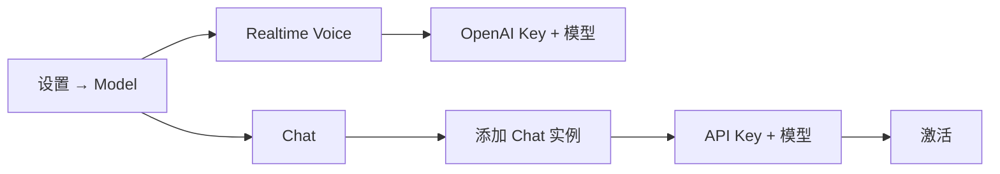

# 服务商配置

Rocky 采用**双层服务商模型**：单轨的 Realtime 语音（驱动主页语音回合），加上多服务商的 Chat 后端（驱动文本聊天，同时也是语音模型 `delegate-task` 转交复杂任务时使用的后端 Agent）。两层都在同一个设置分组里。

## 双层结构

- **Realtime 语音** —— 驱动主页的语音对话回合。一个后端，一份当前配置。
- **Chat 后端** —— 驱动聊天详情页，同时也是语音模型通过 `delegate-task` 调用的子 Agent。可配置多个实例，激活其一。

## Realtime 语音

单轨。Realtime 后端只有一个，且只保留一份当前配置。

### OpenAI Realtime

- **模型**：`gpt-realtime`、`gpt-realtime-mini`
- **API Key**：与 OpenAI 聊天 API Key 相同（`https://platform.openai.com/api-keys`）
- **特点**：低延迟语音、受限工具集（重型任务走 `delegate-task`）
- **配置位置**：**设置 → Model → Realtime Voice**

早期版本曾经提供 GLM Realtime 后端，现已移除。`OpenRockyRealtimeVoiceClient` 协议保留，便于以后再接入新的 Realtime 后端。

## Chat 后端

经典三层抽象（服务商 → 账户 → 模型）。多实例 —— 想配多少账户就配多少，激活其一即可。

### OpenAI

- **模型**：GPT-5、GPT-4o
- **API Key**：来自 [platform.openai.com](https://platform.openai.com)

### Anthropic

- **模型**：Claude Sonnet 4
- **API Key**：来自 [console.anthropic.com](https://console.anthropic.com)

### Azure OpenAI

- **模型**：GPT-4o（Azure 部署）
- **配置**：需要 Azure 资源名称、部署名称、API 版本和 API Key

### Google Gemini

- **模型**：Gemini 2.5 Pro、Gemini 2.5 Flash
- **API Key**：来自 Google AI Studio

### Groq

- **模型**：Llama 3.3 70B
- **API Key**：来自 Groq 控制台

### xAI

- **模型**：Grok 3 Beta
- **API Key**：来自 xAI 平台

### OpenRouter

- **模型**：多模型代理（一个 Key 访问多种模型）
- **API Key**：来自 OpenRouter

### DeepSeek

- **模型**：DeepSeek Chat
- **API Key**：来自 DeepSeek 平台

### 豆包（火山引擎）

- **模型**：Doubao Seed 系列
- **API Key**：来自火山引擎平台

### AIProxy

- **模型**：代理访问各种模型
- **配置**：需要配置服务 URL

## 配置流程

1. 打开 Rocky，进入 **设置 → Model**
2. 配置 **Realtime Voice**，填入 OpenAI Key 并选择 `gpt-realtime` 模型
3. 添加至少一个 **Chat** 服务商实例并激活
4. 回到主页 —— 顶栏胶囊会显示当前 Realtime 模型，状态点变绿即就绪

:::tip
两层可以混搭。例如：OpenAI Realtime 做语音轨道 + Anthropic Claude 做 Chat 后端，是工具密集型任务转交的常见组合。
:::
