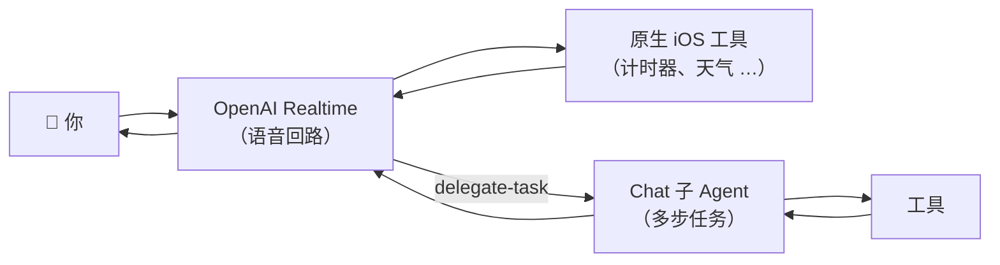

# 语音交互

语音是 Rocky 的主要——也是当前**唯一**的——主页输入方式。文本仍然可用，但只在聊天详情页里。

## 工作原理

Rocky 使用 **OpenAI Realtime API** 作为单一的语音轨道。当你点击主页的 Orb 时：

1. 从设备麦克风捕获音频
2. 通过 WebSocket 实时流式传输到 OpenAI Realtime
3. 模型直接处理语音（无需中间转录）
4. 响应音频流式返回并播放，对话气泡同时渲染

这创造了自然、低延迟的对话体验。

## 双层模型

语音模型负责对延迟敏感的短回合。多步或研究类任务通过 `delegate-task` 工具转交给后端 **Chat 子 Agent**。子 Agent 使用你配置的 Chat 服务商（OpenAI、Anthropic、Gemini …）执行完毕后，返回一段总结，再由语音模型口播给用户。

这种分工让语音回路保持流畅，同时不损失 agent 的执行深度。

## 语音 vs 文本

| | 语音 | 文本 |
|---|---|---|
| **角色** | 主要输入 | 补充 |
| **使用场景** | 任务、提问、命令 | 精确编辑、代码、链接 |
| **位置** | 主页 Orb | 聊天详情页 |

## 服务商支持

| | OpenAI Realtime |
|---|---|
| 模型 | `gpt-realtime`、`gpt-realtime-mini` |
| 协议 | WebSocket |
| 工具调用 | 支持 —— 受限工具集，重型任务通过 `delegate-task` 转交 |

早期版本曾经提供 GLM Realtime 和 Classic（STT + Chat + TTS）路径，现已全部移除。`OpenRockyRealtimeVoiceClient` 协议保留，便于以后再接入新的 Realtime 后端，无需改动主页或会话运行时。

## 主页

- **单一 Orb** —— 既是品牌标识，也是动作按钮。点击开始 / 停止。
- **同心脉冲圈** —— 三层 TimelineView 驱动的圈，闲置时柔和、收音时明显。
- **顶栏 Provider 胶囊** —— 显示当前 Realtime 模型与连接状态点，点击直达设置。
- **状态胶囊** —— `Tap to talk` / `Connecting…` / `Listening` / `Thinking` / `Responding` / `Ready`。
- **实时波形条** —— 收音时在 Orb 下方渲染。
- **轮换提示** —— 闲置时显示（"Try 'Set a 25-minute focus timer'"），每隔几秒切换一次。
- **对话气泡** —— 最近对话以 iMessage 风格浮在 Orb 上方。旧气泡渐隐，当前回合全亮并自动滚动。

## 使用建议

- 自然地说话 —— Rocky 理解日常对话语言
- 明确任务 —— "给张三发个消息" 比 "做那个事情" 效果更好
- 语音在相对安静的环境中效果最佳
