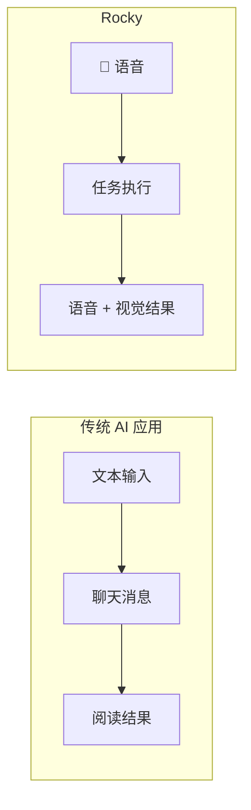

# 介绍

**Rocky** 是一个面向 iPhone 和 iPad 的语音优先 AI Agent App。**OpenRocky** 是它背后的开源项目。

Rocky 不是移动端聊天壳，也不是把 Linux 容器直接搬进手机。它把**语音对话作为最核心的入口**，将语音交互、任务执行、系统桥接和结果回看组织成一个更适合 iOS 和 iPadOS 的 agent 体验。

## 为什么语音优先？

大多数移动端 AI 应用是基于文本的聊天界面。Rocky 采用了完全不同的方式：

- **语音是主入口** — 像和人说话一样和 Rocky 交流，无需打字。
- **文本是补充** — 在需要精确输入（如代码或链接）时使用。
- **执行任务，而非纯聊天** — Rocky 不仅仅回复，它执行任务并产出真实结果。

## 核心理念

- **语音为主** — 主页是语音界面，不是聊天列表。
- **任务执行** — 由 ROS 驱动，内部运行时负责规划和执行任务。
- **iPhone & iPad 原生** — 使用 SwiftUI 构建，利用 iOS 原生桥接和本地执行能力。
- **开源** — 透明开发，社区驱动。

## 平台支持

| 平台 | 状态 |
|----------|--------|
| iOS (iPhone) | 支持 |
| iPadOS (iPad) | 支持 |
| macOS | 暂无计划 |
| Android | 暂无计划 |

## 当前状态

OpenRocky 目前处于 **文档优先 + 早期原型** 阶段。仓库包含：

- 产品定位、iOS 架构文档和参考资料
- 用于验证方向的早期 SwiftUI iOS 原型

原型已经验证了三项关键集成：

- **SwiftOpenAI** — 模型接入和 OpenAI Realtime 会话桥接
- **LanguageModelChatUI** — 聊天详情页挂载到 iOS 原型中
- **ios_system** — 受控本地执行层，用于运行环境初始化和命令执行

## 标准表述

> Rocky 是产品，OpenRocky 是背后的开源项目。

## 链接

- [GitHub](https://github.com/OpenRocky/OpenRocky)
- [Discord](https://discord.gg/SvvsaDA4nE)
- [Telegram](https://t.me/openrocky)
- [作者 X / Twitter](https://x.com/everettjf)
